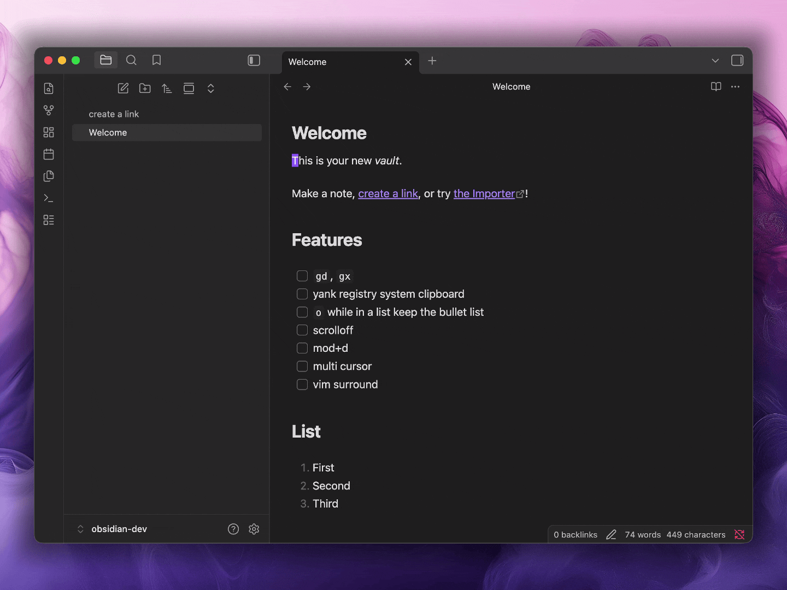

# More Vim

A plugin that adds Vim features missing from Obsidian's built-in Vim mode

---

## Features

| Feature                   | Behavior                                                                                                                                                                                                                      |
| ------------------------- | ----------------------------------------------------------------------------------------------------------------------------------------------------------------------------------------------------------------------------- |
| Vim surround              | Adds `ys`, `ds`, `cs`, and visual-mode `S` for adding, deleting, and changing surrounding characters. Supports brackets, quotes, and the usual aliases (`b`, `B`, `r`).                                                       |
| Multi-cursor motions      | When more than one cursor is active in normal mode, the motions `h j k l w W b B e E $ ^` run **per cursor**. `Escape` collapses back to the main cursor.                                                                     |
| `Mod-D`                   | Empty selection → select the word under the cursor (`viw`). Non-empty selection → find the next occurrence and add a cursor there. Wraps to the top of the file when there are no more matches below. Toggleable in settings. |
| `scrolloff`               | Keeps N lines of context above and below the cursor, like Vim's `scrolloff` option. Configurable in settings.                                                                                                                 |
| System clipboard register | Mirrors yanks and puts to the OS clipboard via the unnamed (`"`) register, and re-syncs on window focus. Toggleable in settings.                                                                                              |
| `o`                       | Open a new line while preserving Markdown list continuation. The built-in Vim `o` breaks lists; this one keeps the bullet/number going.                                                                                       |
| `gd`                      | Open the internal link under the cursor.                                                                                                                                                                                      |
| `gx`                      | Open the external URL under the cursor in a new browser tab.                                                                                                                                                                  |

> [!IMPORTANT]
> `Mod-D` requires you to disable Obsidian's built-in hotkey first. Go to **Settings → Hotkeys**, search for the command currently bound to `Mod-D`, and unbind it. Otherwise Obsidian intercepts the key before this plugin can see it.

## License

[0BSD](./LICENSE) © Colin Lienard
